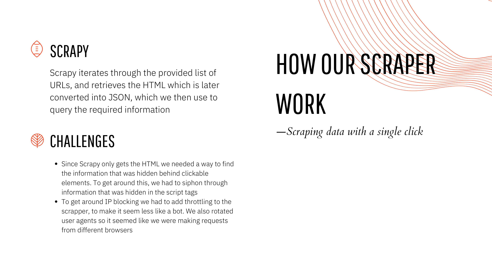
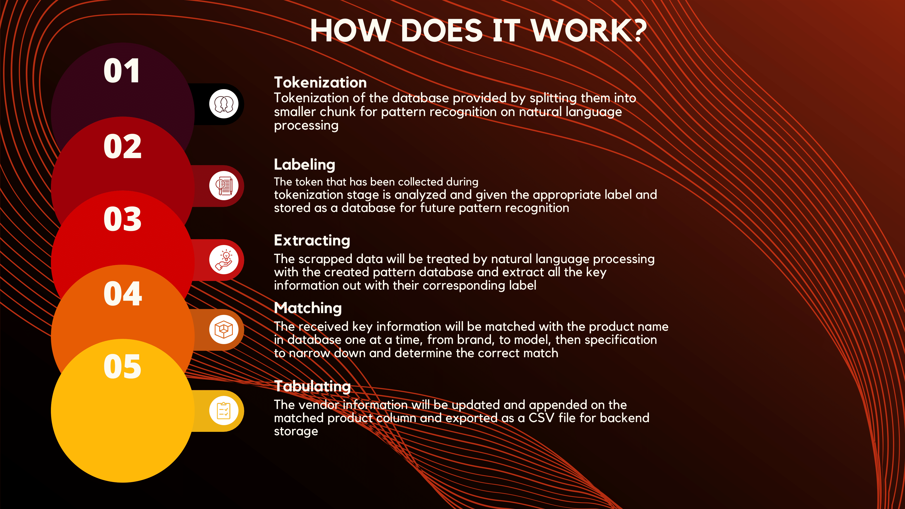

# Priceshop | 42KL SME Innovation Hackathon
This project is a tool to automatically scrape product data from Lazada links, match them to a database and output to a formatted CSV. <br>

We built this during the [42KL](https://42kl.edu.my/) SME Innovation Hackathon 2022. <br>
Here's our [Presentation](content_files/presentation.pdf). <br>
Here's the [Challenge Statement](content_files/PriceShop.pdf). <br>

# How it's built
- Python
- Packages
	- Scrapy | web scraping
	- spacy | tokenisation
	- rapidfuzz | pattern matching
	- pandas | data manipulation

# How it works
## Scraper


## Matcher


# Setup and run
> Clone this repo
```
git clone https://github.com/HackathonScrubs/HargaKedaiMamak
```

> Run setup script
```
./run.sh setup
```

> Update Lazada links
```
input_files/lazada_links.csv
```

> Scrape from links
```
./run.sh scrape
```

> Match and output
```
./run.sh match
```

> Output CSV will be at
```
output.csv
```

# Team
- [Ding Hang](https://github.com/Hanswong42) <br>
- [Nazrin](https://github.com/nazrinshahaf) <br>
- [Eu Lee](https://github.com/42EuLee) <br>
- [Yun Zhe](https://github.com/hooyunzhe) <br>

# References
- [Scrapy](https://docs.scrapy.org/en/latest/)
- [spacy](https://spacy.io/api/doc)
- [rapidfuzz](https://maxbachmann.github.io/RapidFuzz/)
- [pandas](https://pandas.pydata.org/docs/)
